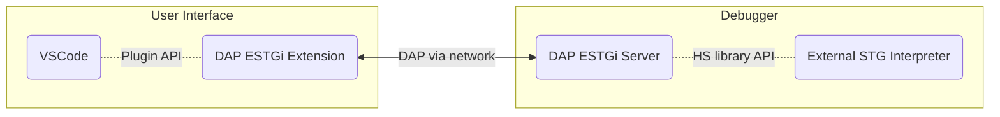

# Haskell ESTGi Debugger

This repository contains the components for Haskell debugging based on the Debug Adapter Protocol ([DAP](https://microsoft.github.io/debug-adapter-protocol)).

* `dap/`: Language and backend independent simple DAP library
* `dap-estgi-server/`: DAP server for External STG Interpreter (DAP-ESTGi)
* `dap-estgi-vscode-extension/`: VSCode extension to support Haskell debugging using DAP-ESTGi server

## Overview

The `dap-estgi-vscode-extension` turns VSCode into Haskell debugger.
VSCode offers a nice debugger UI while the debugger features are provided by the External STG Interpreter DAP Server.



The `dap-estgi-server` and `dap-estgi-vscode-extension` are application specific components, while the
`dap` library is designed to be application independent to support any project that needs a simple DAP framework.

## Setup

1. VSCode setup  
   Enable `allow breakpoints everywhere` option in VSCode settings.
3. Run `dap-estgi-extension`
   * Open `dap-estgi-vscode-extension` folder by using the `Files/Open Folder` menu.
   * Open the `src/extension.ts` file.
   * press F5 to run the extension in a new VSCode window.
5. Start `dap-estgi-server`  
   `(cd dap-estgi-server ; stack run)`

7. Compile debuggee program with GHC-WPC using stack  
   * Add the following lines to debuggee's `stack.yaml`:
     ```
     # use custom ext-stg whole program compiler GHC
     compiler:       ghc-9.2.7
     compiler-check: match-exact
     ghc-variant:    wpc
     setup-info:
       ghc:
         linux64-custom-wpc-tinfo6:
           9.2.7:
             url: "https://github.com/grin-compiler/foundation-pak/releases/download/ghc-9.2.7/ghc-9.2.7-x86_64-unknown-linux.tar.xz"
         macosx-custom-wpc:
           9.2.7:
             url: "https://github.com/grin-compiler/foundation-pak/releases/download/ghc-9.2.7/ghc-9.2.7-x86_64-apple-darwin.tar.xz"
     ```
   * Run: `stack build`
8. Open debuggee program in VSCode  
   * Open debugge project folder by using the `Files/Open Folder` menu.
   * Select the debug view on the side bar
   * click to `create a launch.json file`, then select `Haskell DAP ESTGi`
   * press F5 or the `Play` button to start debugging
