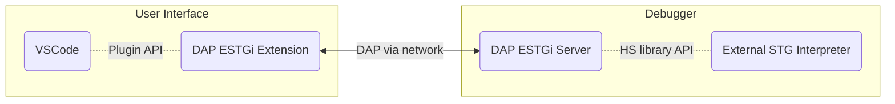

# Haskell ESTGi Debugger

# Table of Contents
1. [Introduction](#introduction)
2. [Overview](#overview)
3. [Setup](#setup)
4. [Development](#development)

## Introduction

This repository contains the components for Haskell debugging based on the Debug Adapter Protocol ([DAP](https://microsoft.github.io/debug-adapter-protocol)).

  - [`dap/`](dap/): Language and backend independent simple DAP library
  - [`dap-estgi-server/`](dap-estgi-server/): DAP server for External STG Interpreter (DAP-ESTGi)
  - [`dap-estgi-vscode-extension/`](dap-estgi-vscode-extension/): VSCode extension to support Haskell debugging using DAP-ESTGi server

## Overview

The `dap-estgi-vscode-extension` turns VSCode into a Haskell debugger.
VSCode offers a nice debugger UI while the debugger features are provided by the External STG Interpreter DAP Server.



The `dap-estgi-server` and `dap-estgi-vscode-extension` are application specific components, while the
`dap` library is designed to be application independent to support any project that needs a simple DAP framework.

## Setup
 - Enable `allow breakpoints everywhere` option in VSCode settings.

### Run `dap-estgi-extension`
   - Run `(cd dap-estgi-vscode-extension ; npm install)`
   - Open `dap-estgi-vscode-extension` folder by using the `Files/Open Folder` menu.
   - Open the `src/extension.ts` file.
   - Press F5 to run the extension in a new VSCode [Extension Development Host] window.

### Start `dap-estgi-server`
   `(cd dap-estgi-server ; stack run)`

**Note**: If using Darwin OSX and you receive

```
external-stg-interpreter> * Missing (or bad) C library: omp
external-stg-interpreter> This problem can usually be solved by installing the system package that
external-stg-interpreter> provides this library (you may need the "-dev" version). If the library is
external-stg-interpreter> already installed but in a non-standard location then you can use the flags
external-stg-interpreter> --extra-include-dirs= and --extra-lib-dirs= to specify where it is.If the
external-stg-interpreter> library file does exist, it may contain errors that are caught by the C
external-stg-interpreter> compiler at the preprocessing stage. In this case you can re-run configure
external-stg-interpreter> with the verbosity flag -v3 to see the error messages.
```

Try installing `libomp` from [brew](https://formulae.brew.sh/formula/libomp) and then running:


```bash
$ stack run --extra-include-dirs=/usr/local/opt/libomp/include --extra-lib-dirs=/usr/local/opt/libomp/lib
```

### Compile debuggee program with GHC-WPC using stack
   - Add the following lines to debuggee's `stack.yaml`:

	 ```yaml
	 # use custom ext-stg whole program compiler GHC
	 compiler:       ghc-9.2.7
	 compiler-check: match-exact
	 ghc-variant:    wpc
	 setup-info:
	   ghc:
		 linux64-custom-wpc-tinfo6:
		   9.2.7:
			 url: "https://github.com/grin-compiler/foundation-pak/releases/download/ghc-9.2.7/ghc-9.2.7-x86_64-unknown-linux.tar.xz"
		 macosx-custom-wpc:
		   9.2.7:
			 url: "https://github.com/grin-compiler/foundation-pak/releases/download/ghc-9.2.7/ghc-9.2.7-x86_64-apple-darwin.tar.xz"
		 macosx-aarch64-custom-wpc:
		   9.2.7:
			 url: "https://github.com/grin-compiler/foundation-pak/releases/download/ghc-9.2.7/ghc-9.2.7-aarch64-apple-darwin.tar.xz"
	 ```
   - Run `stack build`
	 i.e. build the provided sample hello world: `(cd sample-program-to-debug ; stack build)`

### Open debuggee program in VSCode [Extension Development Host]
   - Open debugge project folder by using the `Files/Open Folder` menu.
   - Select the debug view on the side bar
   - Click to `create a launch.json file`, then select `Haskell DAP ESTGi`
   - Press F5 or the `Play` button to start debugging

## Development

### Allow breakpoints everywhere
  

### Run `dap-estgi-extension`
  

### Start `dap-estgi-server`
  

### Compile debuggee program with GHC-WPC using stack
  

### Open debuggee program in VSCode [Extension Development Host]
  
